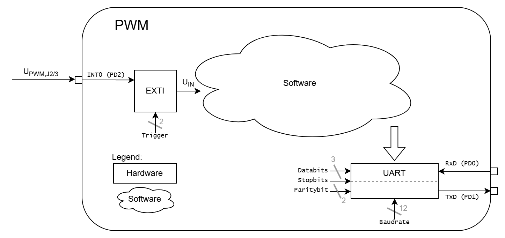

  

# `WFG` - Waveform Generator (Signalgenerator)

The `WFG` is a board with an [LM324](#additional-information) or any other 2-channel operational amplifier. The board itself is driven with a voltage of `5V`. It generates a triange and a pwm signal. Both signals can be adjustet through the onboard trimmer. When the board is connected to a voltage source the `green` led signals the readiness.

Optional the generated signals can be readin with an external interrupt and a internal running timmer on a microcontroller and status data can be sent to a terminal over UART. A demo how this can be done is attached and can be tested with an [ATmega16A](#additional-information).

> This design is derived form Analog Devices. Details can be found [here](https://www.analog.com/en/resources/design-notes/pulsewidth-modulator-operates-at-various-levels-of-frequency-and-power.html)

| Experience | Level |
|:------------|:-----:|
| Soldering   |  |
| Software    |  |

# Downloads

| Type      | File               | Description              |
|:---------:|:------------------:|:-------------------------|
| Simulation | [asc](https://github.com/0x007E/wfg/raw/refs/heads/main/WFG.asc) | LTSpice Simulation | 
| Lochmaster | [lm4](https://github.com/0x007E/wfg/raw/refs/heads/main/WFG.LM4) | Stripe grid circuit board | 
| Schematic | [pdf](https://github.com/0x007E/wfg/releases/latest/download/schematic.pdf) / [cadlab](https://cadlab.io/project/29870/main/files) | Schematic files |
| Board | [pdf](https://github.com/0x007E/wfg/releases/latest/download/pcb.pdf) / [cadlab](https://cadlab.io/project/29870/main/files) | Board file |
| Drill | [pdf](https://github.com/0x007E/wfg/releases/latest/download/drill.pdf) | Drill file |
| PCB | [zip](https://github.com/0x007E/wfg/releases/latest/download/kicad.zip) / [tar](https://github.com/0x007E/wfg/releases/latest/download/kicad.tar.gz) |  	KiCAD/Gerber/BoM/Drill files |
| Firmware | [zip](https://github.com/0x007E/wfg/releases/latest/download/firmware.zip) / [tar](https://github.com/0x007E/wfg/releases/latest/download/firmware.tar.gz) | Demo Firmware for ATmega16 |

# Hardware

The pcb is created with `KiCAD`. All files are built with `github actions` so that they are ready for a production environment.

## PCB

The circuit board is populated on one side. The best way for soldering the `SMD` components is within a vapor phase soldering system and for the `THT` components with a standard system.

### Top Layer

### Bottom Layer

# Configuration

Within the different trimmers the waveforms can be adjustet in height, frequency and duty cycle.

# Software

The demo firmware (`ATmega16A`) of the `WFG` can be used to measure the frequency and duty cycle of the generated PWM signal and transmit the data over uart to a terminal.

## Dataflow diagram

# Additional Information

| Type       | Link               | Description              |
|:----------:|:------------------:|:-------------------------|
| LM324 | [pdf](https://www.ti.com/lit/ds/symlink/lm324.pdf) | Quad operational amplifier |
| ATmega16A | [pdf](https://ww1.microchip.com/downloads/en/devicedoc/atmel-8154-8-bit-avr-atmega16a_datasheet.pdf) | Microchip ATmega16A Datasheet |

---

R. GAECHTER
